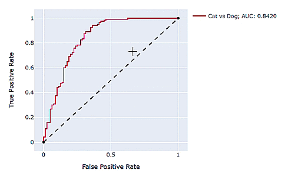

### Plotly ROC

Creates interactive ROC or precision-recall curves to simplify evaluation and choose appropriate thresholds. Wrapper on top of plotly for all graphs and tooltip interactions.

### Requirements
* Python 3.6 or higher
* plotly
* pandas

### Installation
```
git clone https://github.com/ayplam/plotly-roc
cd plotly_roc
python setup.py install
```

### Usage
```
import random
from plotly_roc import metrics, graphs

random.seed(42)
ns, ps=(80, 120)
labels = [0]*ns + [1]*ps
probas = [random.normalvariate(0.4, 0.25) for _ in range(ns)] + [random.normalvariate(0.7, 0.15) for _ in range(ps)]
metrics_df = metrics.metrics_df(labels, probas)
graphs.roc_curve(metrics_df, line_name="Cat vs Dog", line_color="crimson", cm_labels=["CAT", "DOG"])
```


```
graphs.precision_recall_curve(metrics_df, line_name="Dog Precision", line_color="steelblue", cm_labels=["CAT", "DOG"])
```

